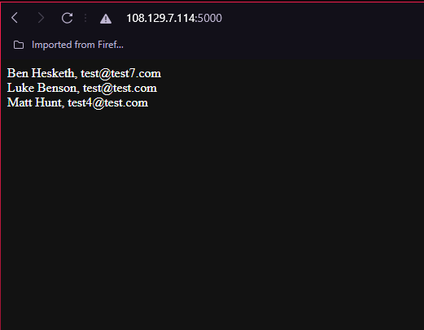
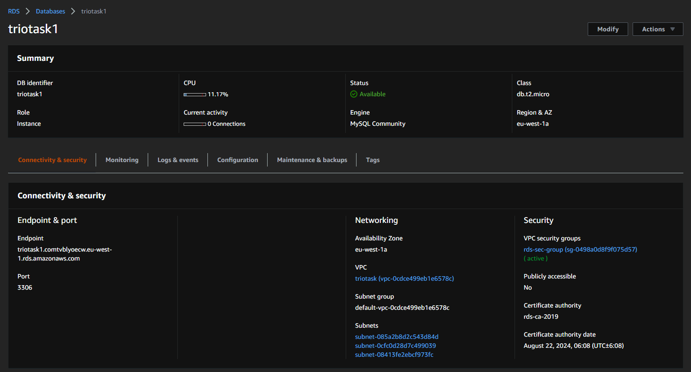
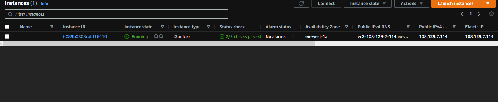
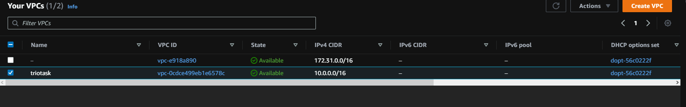
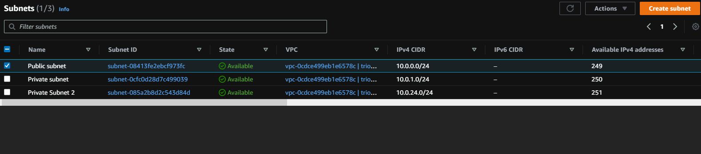
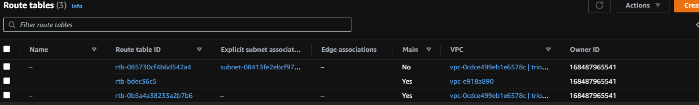
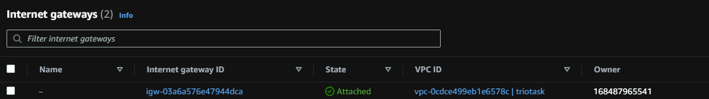
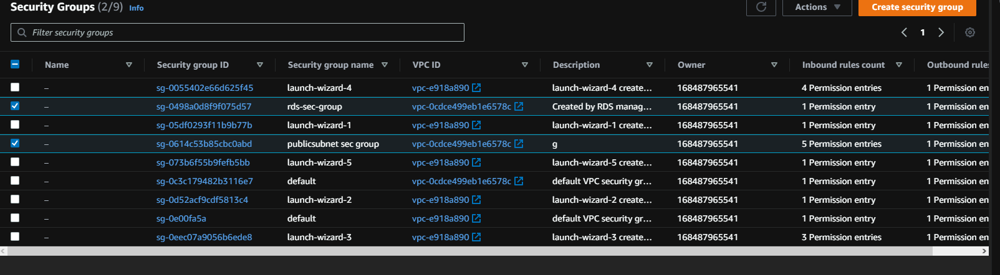

# Trio-task

This is a Flask application that is set up and configured to work with a database and nginx. Write a docker-compose.yaml that will bring all these services up and allow the app to run on port `80`.

---------------------------------------------------------------------------------------
## As seen below, the task was completed succesfully, the web application is running within AWS on an EC2 instance.

---------------------------------------------------------------------------------------
## Shown below is an image of the RDS dashboard, contained within is the RDS instance used to house the mysql database for the web application.

the web application uses mysql to create a working database of which to draw data from, in this case 'users' as seen in image 1. 
the RDS was created and stored within the custom VPC made to fit the criteria, and was within its' own subnet, which only allowed communications within the VPC, so in this instance, the security group only allowed connection to the EC2 instance itself, which enabled basic security for the database portion of the application.

-------------------------------------------------------------------------------------------
## The EC2 instance as shown below;

the EC2 instance, which used UBUNTU 20.08, was created using a T2 micro for this web application, putting aside the costs, the application was fairly light and only pulled information from the RDS database instance, meaning that the hardware requirements were fairly lightweight. the T2 micro contains one virtual CPU core and one GiB of Random Access memory, which was more than enough for the requirements of the web application.

--------------------------------------------------------------------------
## The custom VPC (Triotask)

The custom VPC created for the task, was designed within the VPC wizard on AWS, this allowed an automated creation of a VPC that contains one public subnet, one private subnet, routing tables for both, an internet gateway and a NAT device. this streamlined the process and allowed me to expedite the creation of the VPC and lessen the chances of making any mistakes while creating the network itself. once created, I added another private subnet within another availablity zone for the VPC, this satisfied the availability zone requirements of adding the RDS to the VPC, also allowing the RDS server to withstand outages by having instances within multiple availability zones.

----------------------------------------------------------------------------------------------
## The subnets within the VPC

within the VPC as mentioned above, are three subnets, one publicly available to enable the EC2 instance to connect and communicate with the world wide web, and two private subnet, within which sat the RDS, enabling it to connect and communicate with only the EC2 instance within the VPC. the two private subnets are housed within different availability zones, EU-west-1a and b respectively to enable network resilience and availability in the case of an outage.

-------------------------------------------------------------------------------------------------
## Routing tables, where and why?

the routing tables shown below were created as part of the automated VPC creation and were attached to the two original subnets, within the VPC, this enabled me to have the public subnet communicate with the internet gateway and the private subnet, and allowed the private subnet to determine where the inbound/outbound traffic would be headed to.

----------------------------------------------------------------------------------------------------
## Internet gateways, YOU SHALL NOT PASS

the internet gateway created below very simply allowed the EC2 instance to connect and communicate to the outer internet and provide communication to the EC2 instance for the sake of development and for testing. 

--------------------------------------------------------------------------------------------------------
## Security groups, got any ID?

the security groups created, as seen by the two checked groups within the dashboard below. one was created as part of the automated VPC creation process to enable the outbound/inbound traffic rules for the public subnet and is assosciated as such, however, the second one was created for the private subnet in order to enable only the private IP of the EC2 instance to connect to the RDS and as such governed the traffic flow of the private subnet, so if any other instances or application components were added to the private subnet portion of the VPC, they too would be governed by the traffic rules set forth in the RDS security group. this would require me to make some changes if implemented, however, for the private subnet, only containing the RDS instance, the rule of only allowing the private IP of the EC2 instance to connect and only having traffic on port 3306 (mysql), worked perfectly.

